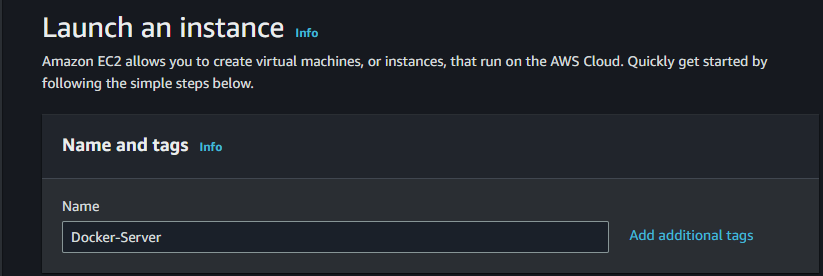
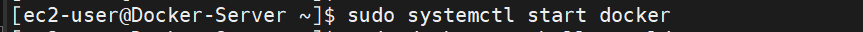

# DEPLOY A WORDPRESS WEBSITE INTO A DOCKER CONTAINER

# WORDPRESS
WordPress is a web content management system. It was originally created as a tool to publish blogs but has evolved to support publishing other web content, including more traditional websites, mailing lists and Internet forum, media galleries, membership sites, learning management systems and online stores.

# DOCKER
Docker is a set of platform as a service products that use OS-level virtualization to deliver software in packages called containers. The service has both free and premium tiers. The software that hosts the containers is called Docker Engine. It was first released in 2013 and is developed by Docker, Inc.

# DOCKER CONTAINER
A container is a standard unit of software that packages up code and all its dependencies so the application runs quickly and reliably from one computing environment to another. A Docker container image is a lightweight, standalone, executable package of software that includes everything needed to run an application: code, runtime, system tools, system libraries and settings.

# STEP 1: LAUNCH AND CONFIGURE AN AMAZON LINUX 2 INSTANCE.
1. Sign in into your AWS Console and Click on EC2 [AWS WEBSITE](https://aws.amazon.com/).
2. Navigate to the EC2 Dashboard and Click on Launch Instance.
- Choose the Server Name.

- Choose the Amazon Machine Image. (A lower version would better because they are more stable).

- I would be using Amazon Linux 2 for this project.

- Choose Instance type and KeyPair.

- Configure network settings and make sure these security groups are open

- Configure storage settings.

- Then, Click on Launch Instance and the server should be running in few minutes.


### STEP 2: CONNECTING TO THE EC2 INSTANCE.
1. To connect to your server you would need a ssh-client
2. I would be using Mobaxterm to access my Amazon Linux 2 EC2 Instance.
3. [Download Mobaxterm](https://mobaxterm.mobatek.net/download.html)
4. To access your server using Mobaxterm you would need some credentials e.g
- Public IP Address from AWS Console.
- Private Key (.pem) on your local computer.
- Server Name (ec2-user) for Amazon Linux 2 Server.


### Step 3: PREPARE THE SERVER
1. Change the hostname of the server.
```
sudo vim /etc/hostname

```

2. Restart to server to adopt the new hostname for the server.
```
sudo reboot

```

3. Restart the server
```
Press CTRL + R

```

4. Make sure the server apt repo is up-to-date
```
sudo yum update -y

```

# STEP 4: INSTALL DOCKER 
1. Install Docker and enable Docker to start on boot
```
sudo yum install docker -y

```

2. Starting the Docker service
```
sudo systemctl start docker

```

3. Verifying the installation
```
sudo docker run hello-world

```

4. Enabling the Docker service
```
sudo systemctl enable docker

```

5. Check the Docker version
```
docker --version

```

6. Add User to Docker Group
```
sudo usermod -a -G docker $(whoami)

```


# STEP 5: INSTALL DOCKER-COMPOSE
1. To install docker-compose 
```
sudo curl -L https://github.com/docker/compose/releases/latest/download/docker-compose-$(uname -s)-$(uname -m) -o /usr/local/bin/docker-compose

```

2. Make the docker-compose file executable
```
sudo chmod +x /usr/local/bin/docker-compose
```

3. To check the version of docker-compose installed
```
docker-compose version

```


# STEP 6: CLONE THE GITHUB REPO ON YOUR SERVER
1. Install git software to run git commands
```
sudo yum install git -y

```

2. Clone the git repo using the git clone command
```
git clone https://github.com/Iron-chest/wordpress-mysql-dockercompose.git

```

3. Do a syntax check on docker-compose yaml file
```
docker-compose config

```

4. Execute your docker-compose yaml file for default docker-compose file name
```
docker-compose up -d

```

5. If you are using a custom file
```
docker-compose -f docker-composeFileName up -d

```

6. Check if your docker container are running 
```
docker ps

```
OR
```
docker container ls

```


# STEP 7: ACCESS YOUR WORDPRESS WEBSITE 
1. Access your WordPress Website on your IPAddress:portnumber
2. Choose your preferred language

3. Fill in the required details like Website Name, Password, email and Click Install WordPress.

4. Login with your username and Password and your Admin Page for WordPress Website should be up and running.

5. Your WordPress Website is up and running.

6. You can check your phpMyAdmin Webpage.

7. To stop the docker containers
```
docker-compose down

```

<!-- To check your server version
cat  /etc/os-release

To execute commands inside the docker containen
docker exec -it containerId /bin/bash -->
